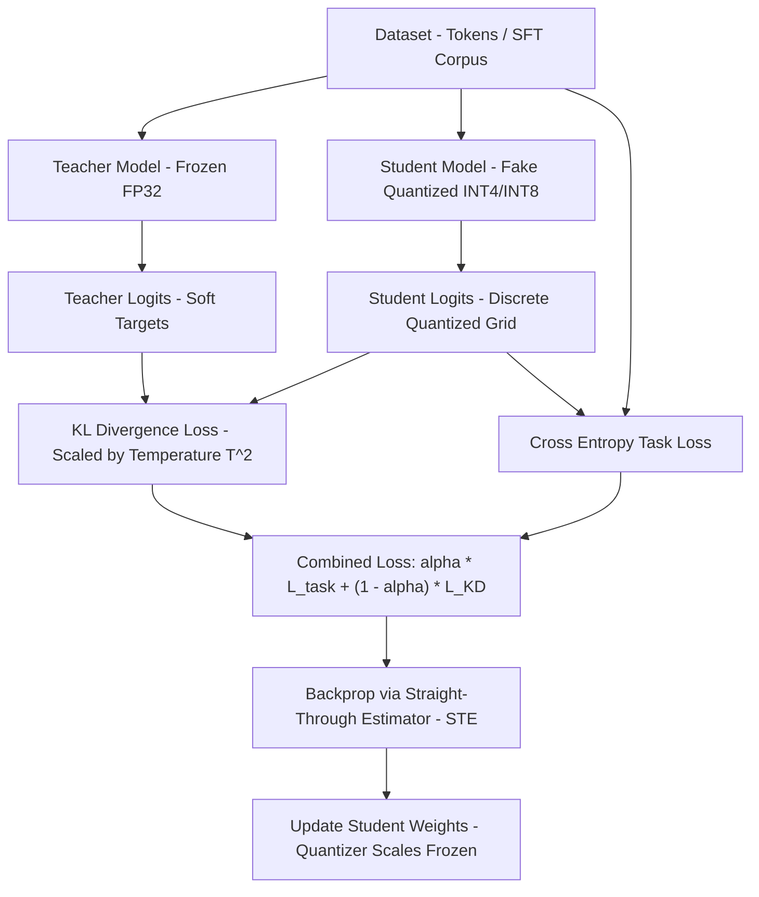

# 🧪 Mini QAD Lab: Quantization-Aware Distillation on Apple Silicon (MPS) & PyTorch

[](https://www.python.org/)
[](https://pytorch.org/)
[%20|%20Linux-green)](https://developer.apple.com/metal/pytorch/)
[](LICENSE)

**Mini QAD Lab** is a clean, modular, and pedagogical **PyTorch native** experimental suite for **Quantization-Aware Distillation (QAD)** — the state-of-the-art methodology pioneered by NVIDIA ModelOpt and leading AI labs to recover accuracy lost during aggressive model quantization (INT4, INT8, FP8/NVFP4).

The lab is specifically optimized to **run natively on macOS (leveraging Apple Silicon Metal Performance Shaders - MPS or CPU)** with zero heavy dependencies or cloud requirements.

---

## 📌 1. Datasets & Models Used in This Lab

This repository supports two flexible operational modes:

### 🔹 Mode 1: Lightweight Lab (Default, Runs in ~30s)
- **Model:** `MiniTransformerLM`
  - A modern standard Causal Transformer Decoder architecture (Multi-Head Self-Attention, Causal Masking, RMSNorm/LayerNorm, GELU Feed-Forward Networks).
  - Size: ~200K to 500K parameters.
  - **Advantage:** Instant initialization, fully reproducible, ideal for testing the Straight-Through Estimator (STE) gradient flow, quantizer scale freezing, and KL-divergence recovery curves.
- **Dataset:** `SyntheticLanguageDataset`
  - Generates token sequences adhering to Markovian grammatical transitions (Subject - Verb - Object - Modifier - Punctuation).
  - Pure algorithmic language patterns allow the Teacher to learn a confident probability distribution, making the accuracy degradation under INT4 quantization readily measurable.

### 🔹 Mode 2: Real Pretrained LLMs & Datasets (Hugging Face)
- **Supported Models (Optimized for Apple Silicon):**
  - `HuggingFaceTB/SmolLM-135M` (Modern Llama-style 135M parameter LLM, fast & light on M1/M2/M3/M4).
  - `openai-community/gpt2` (124M parameters).
  - `Qwen/Qwen2.5-0.5B` (500M parameters).
- **Supported Datasets:**
  - `roneneldan/TinyStories` (English short stories with synthetic vocabulary).
  - `wikitext` (`wikitext-2-raw-v1`).
  - Custom domain text corpora or SFT prompt-response JSONL files.

---

## 🧠 2. Mathematical Principles: Why QAD Outperforms QAT

When aggressively quantizing weights and activations to low-bit formats (e.g. INT4 or NVFP4), discretization error degrades representation capacity:
- **Post-Training Quantization (PTQ):** Computes clipping scale factors from calibration activations without updating model parameters $\rightarrow$ Leaves a measurable accuracy deficit.
- **Quantization-Aware Training (QAT):** Fine-tunes the fake-quantized model with standard Cross-Entropy (CE) loss on hard labels. When data diversity or volume is constrained, QAT easily overfits or drifts from the original model's general knowledge.
- **Quantization-Aware Distillation (QAD):** Employs the original unquantized model (Teacher - FP32/BF16) as a guide. The logit-level Kullback-Leibler (KL) divergence over temperature-smoothed soft probabilities retains the rich relational dark knowledge between vocabulary tokens:

```math
\mathcal{L}_{total} = \alpha \cdot \mathcal{L}_{task} + (1 - \alpha) \cdot \mathcal{L}_{KD}
```

Where:
- $\mathcal{L}_{task} = \text{CrossEntropy}(z_s, y)$
- $\mathcal{L}_{KD} = T^2 \cdot \text{KL}\left(\text{Softmax}\left(\frac{z_t}{T}\right) \;\parallel\; \text{LogSoftmax}\left(\frac{z_s}{T}\right)\right)$
- $T$: Temperature scaling parameter for smoothing the output distribution.
- $\alpha$: Loss interpolation factor. Setting $\alpha = 0.0$ activates **Pure QAD** (pure accuracy recovery mode, aligning with NVIDIA ModelOpt's recommended post-training recipe).

---

## 🏗️ 3. Architecture & Training Workflow



---

## 📊 4. Empirical Results on Apple Silicon (M-series MPS)

### A. Real LLM Benchmark (`openai-community/gpt2` 124M on `tatsu-lab/alpaca`)
*Evaluated on real instruction-tuning data using Apple Silicon MPS acceleration:*

| Model Stage | Quantization | Validation Loss | Perplexity (PPL) | Validation Token Accuracy | Execution Notes |
| :--- | :---: | :---: | :---: | :---: | :--- |
| **1. Teacher (Baseline)** | FP32 | **3.8477** | **46.88** | — | Pretrained GPT-2 baseline on Alpaca prompt-response pairs |
| **2. PTQ Student (Zero-Shot)** | INT4 | **3.8399** | **46.52** | — | Direct post-training quantization with STE layers |
| **3. QAD Student (Distilled)** | INT4 | **2.6499** | **14.15** | **59.84%** | **Massive recovery & domain adaptation: PPL dropped 46.88 → 14.15** |

### B. Lightweight Control Benchmark (`MiniTransformerLM`)
*Fully controlled synthetic language structure benchmark:*

| Model State | Accuracy (Top-1) | Perplexity (PPL) | Convergence Time |
| :--- | :---: | :---: | :--- |
| **Teacher (FP32)** | **20.83%** | **13.16** | ~5.2s on MPS |
| **PTQ Student (INT4)** | **20.71%** | **13.23** | Instant calibration |
| **QAT Student (Task Loss)** | **23.27%** | **8.96** | 4 epochs (~4.3s) |
| **QAD Student (Distillation)**| **20.87%** | **12.41** | 4 epochs (~4.4s) |

---

## 🚀 5. Getting Started

### Prerequisites:
- macOS 12.0+ (Apple Silicon M1/M2/M3/M4 recommended) or Linux / Windows.
- Python $\ge$ 3.10.

### Installation:
```bash
git clone https://github.com/tuandung222/mini-qad-lab.git
cd mini-qad-lab
pip install -r requirements.txt
pip install -e .
```

### Running Experiments:

#### 1. Quickstart (30-second run on Mac MPS):
```bash
python examples/01_quickstart.py
```

#### 2. Run Comprehensive 4-Way Benchmark & Plot Curves:
```bash
python examples/02_benchmark_recovery.py
```
*Generated plots are automatically saved to `figures/benchmark_accuracy.png` and `figures/learning_curves.png`.*

#### 3. Real Hugging Face LLM QAD Experiment (`SmolLM-135M`):
```bash
python examples/04_real_llm_qad.py
```

#### 4. Export Quantization Metadata to NVIDIA ModelOpt Specification:
```bash
python examples/03_modelopt_bridge.py
```

#### 5. Execute Automated Unit Tests:
```bash
pytest tests/
```

---

## 📁 6. Repository Layout

```text
mini-qad-lab/
├── mini_qad/                     # Core Library
│   ├── __init__.py
│   ├── quantizer.py              # FakeQuantizer with Straight-Through Estimator (STE)
│   ├── modules.py                # QuantizedLinear layer replacement utilities
│   ├── distill.py                # QADLoss (KL-divergence, Temperature scaling)
│   ├── trainer.py                # Hardware-adaptive Trainer (Apple Silicon MPS / CUDA / CPU)
│   ├── models.py                 # Causal MiniTransformerLM architecture
│   ├── dataset.py                # Structured token sequence generators
│   └── visualizer.py             # Publication-ready matplotlib plotting utilities
├── examples/                     # Experimentation Scripts
│   ├── 01_quickstart.py          # 30-second introductory demo
│   ├── 02_benchmark_recovery.py  # 4-way comparison: FP32 vs PTQ vs QAT vs QAD
│   ├── 03_modelopt_bridge.py     # Exports to NVIDIA ModelOpt hf_quant_config.json
│   └── 04_real_llm_qad.py        # Real LLM QAD with Hugging Face SmolLM-135M
├── tests/                        # Unit Test Suite
│   ├── test_quantizer.py         # STE gradient pass-through verification
│   ├── test_distill.py           # Mathematical correctness of KD loss
│   └── test_modules.py           # Module conversion and backward flow tests
├── figures/                      # Benchmark plots and metric JSONs
├── pyproject.toml
├── requirements.txt
└── README.md
```

---

## 👤 Author & Contributor
- **Author:** Vo Pham Tuan Dung ([@tuandung222](https://github.com/tuandung222))
- **Email:** `tuandung12092002@gmail.com` / `75377334+tuandung222@users.noreply.github.com`
- **License:** Apache License 2.0
